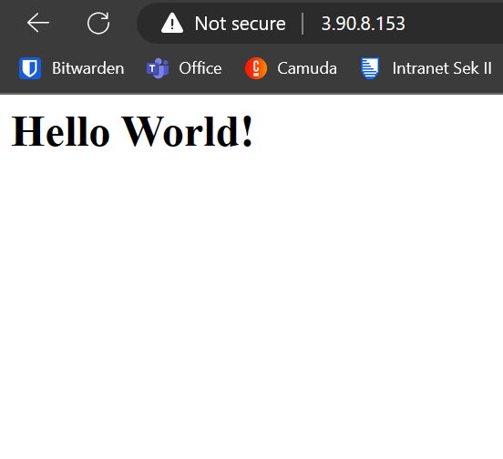

= KN02

== Lab 4.1 - EC2

=== html
html view from EC2 web server inclusive IPv4 address

=== Instance
ec2 instance overview with all existing instances

image::img/instances.png[]

=== Details
details of ec2 instance inclusive public IPv4

image::img/details.png[]

=== inbound rules
all inbound rules of instance

image::img/inbound_roules.png[]

== Lab 4.2 - S3

=== html

=== Buckets

=== Files in Bucket

=== Properties "Static website hosting"

