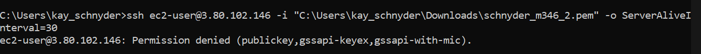
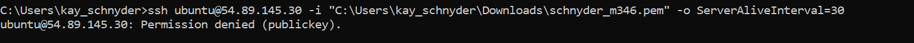

= KN02

== Lab 4.1 - EC2

=== html
html view from EC2 web server inclusive IPv4 address

=== Instance
ec2 instance overview with all existing instances

image::img/instances.png[]

=== Details
details of ec2 instance inclusive public IPv4

=== inbound rules
all inbound rules of instance

image::img/inbound_roules.png[]

== Lab 4.2 - S3

=== html
view of website in bucket inclusive IPv4

=== Buckets
list of all existing buckets

=== Files in Bucket
the list with all the files in the bucket

=== Properties "Static website hosting"
show all properties of static website hosting

==  Zugriff mit SSH-Key

=== ssh connection with permission

=== ssh connection without permission

=== instance for ssh configuration

image::img/ssh_instance.png[]

==  Cloud-init Datei Verstehen

[source, yaml]
----
#cloud-config
users: #user collection
  - name: ubuntu #name of user
    sudo: ALL=(ALL) NOPASSWD:ALL #enable NOPASSWD for all -> disable password
    groups: users, admin #add user to groups
    home: /home/ubuntu #specify home directory for user
    shell: /bin/bash #specify shell language for user
    ssh_authorized_keys: #collection of public ssh keys
      - ssh-rsa AAAAB3NzaC1yc2EAAAADAQABAAABAQC0WGP1EZykEtv5YGC9nMiPFW3U3DmZNzKFO5nEu6uozEHh4jLZzPNHSrfFTuQ2GnRDSt+XbOtTLdcj26+iPNiFoFha42aCIzYjt6V8Z+SQ9pzF4jPPzxwXfDdkEWylgoNnZ+4MG1lNFqa8aO7F62tX0Yj5khjC0Bs7Mb2cHLx1XZaxJV6qSaulDuBbLYe8QUZXkMc7wmob3PM0kflfolR3LE7LResIHWa4j4FL6r5cQmFlDU2BDPpKMFMGUfRSFiUtaWBNXFOWHQBC2+uKmuMPYP4vJC9sBgqMvPN/X2KyemqdMvdKXnCfrzadHuSSJYEzD64Cve5Zl9yVvY4AqyBD aws-key #public ssh key with rsa type
ssh_pwauth: false #disable ssh password authentication
disable_root: false #disable root login
package_update: true #update ubuntu packages on setup
packages: #packages which will be installed in setup
    - curl #script transfer package
    - wget #retrieves web servers
----

==  SSH-Key und Cloud-init

=== Connection with second key

=== Connection with first key

=== Instance with second key

=== Cloud innit file

link:cloud-innit.yaml[]
