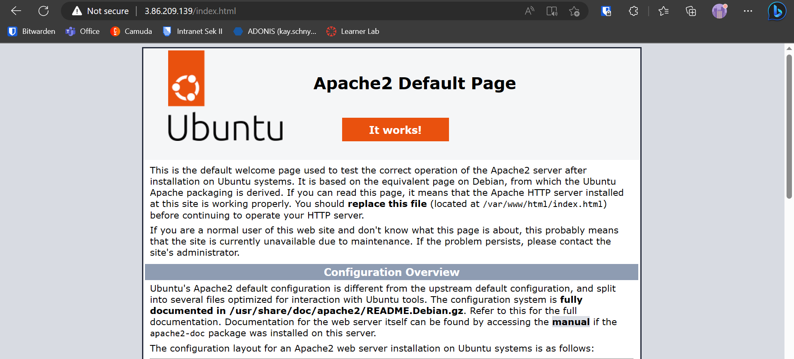
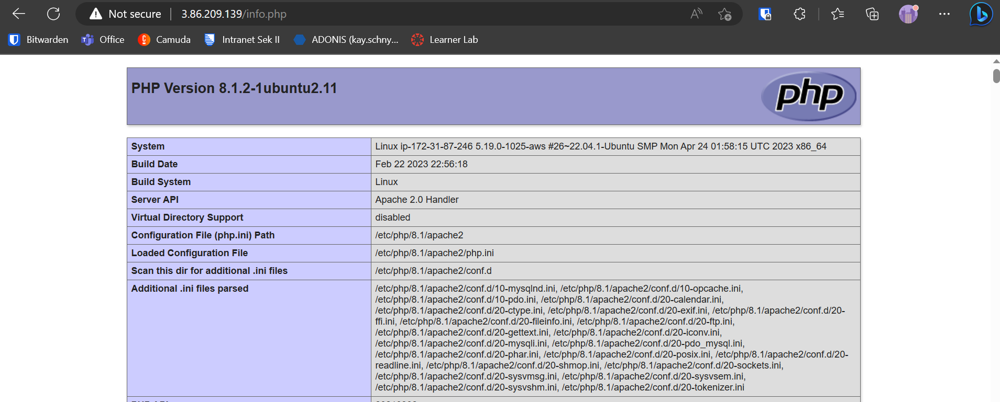
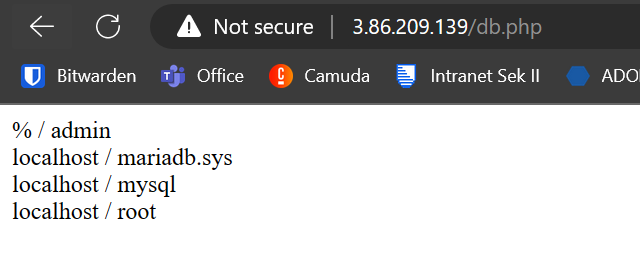
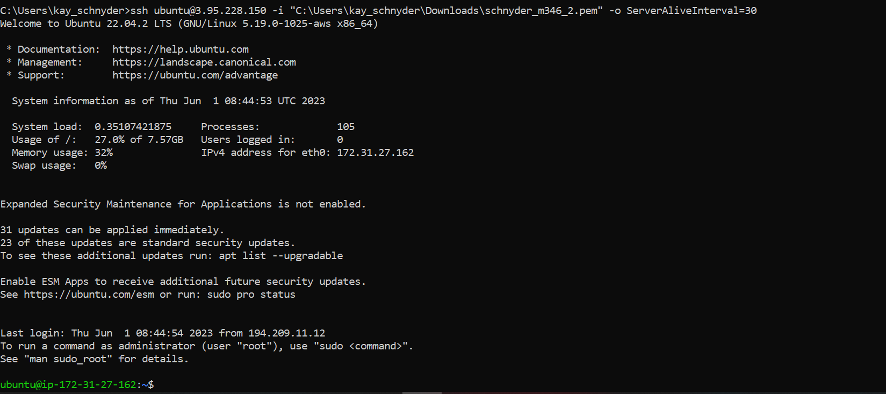
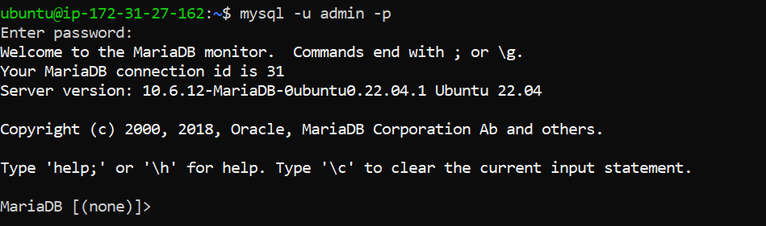
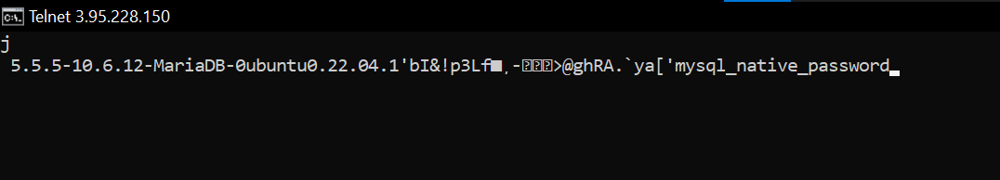

= KN03

== A) Installation von Web- und Datenbankserver

=== apache site

=== php site

=== db site

== B) Auftrennung von Web- und Datenbankserver

=== ssh connection to db server and db login

=== telnet connection

=== cloud init file for db

link:cloud-init-db.yaml

=== sites from web server

