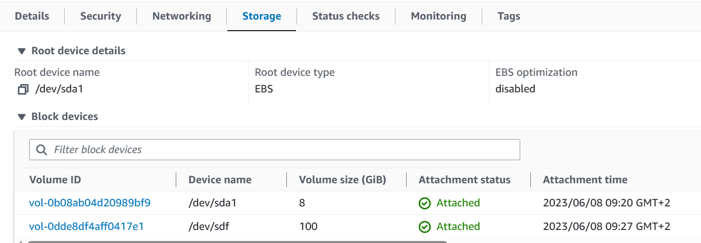

= KN03

== A) Installation von Web- und Datenbankserver

=== apache site

image::img/apache.png[]

=== php site

=== db site

== B) Auftrennung von Web- und Datenbankserver

=== ssh connection to db server and db login

image::img/ssh_db.png[]

=== telnet connection

=== cloud init file for db

link:cloud-init-db.yaml[]

=== db site

=== php site

=== apache site

=== db connection adminer

== C) Speicher

=== Welchem Speichermodell wird S3 zugeordnet?

Ich nehme an S3 ist warm storage, weil es für cloud-native Applikationen verwendet werden kann aber auch als Archive.
Weshalb es sich nicht lohnt ein Hot Storage zu haben aber es evtl zu oft darauf zugegriffen wird für cold storage.

=== EBS

Vor dem Löschen der Instanz sieht man eine Fehlermeldung, welche mitteilt,
dass das EBS Volumen mit dem root Storage standard gemäss zusammen mit der Instanz gelöscht wird.

Nach dem Löschen der Instance sieht man, dass das Root Volumen mit der ID vol-0b08ab04d20989bf9 nicht mehr vorhanden ist.
Das zusätzlich erstellte Volumen ist jedoch immer noch zu sehen und einfach zu keiner Instanz mehr zugeordnet.
Dies liegt daran, dass nur Volumen gelöscht werden die als root erkennt werden und bei Ubuntu ist es standard,
dass root Volumen über /dev/sda1 gemounted werden und nicht wie das zustäzliche Volumen in diesem Fall über /dev/sdf.