= KN04

== Websites

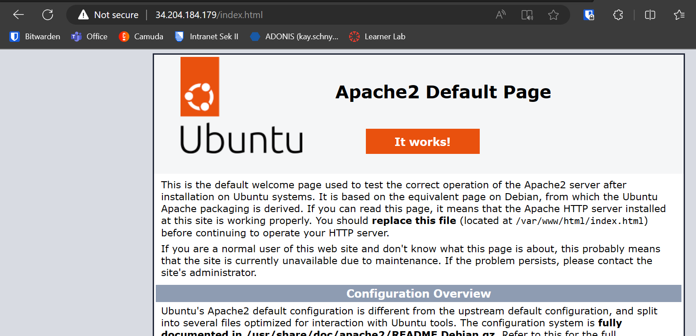

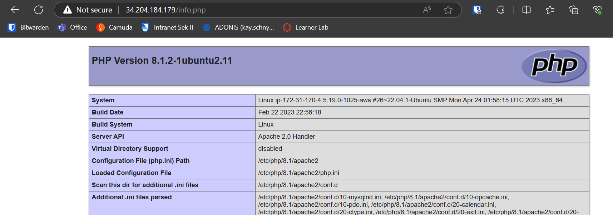

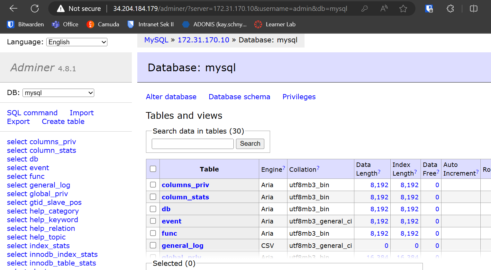

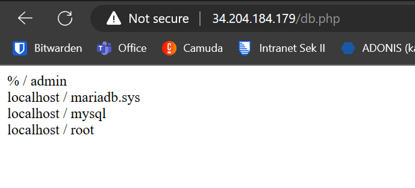

== Subnet

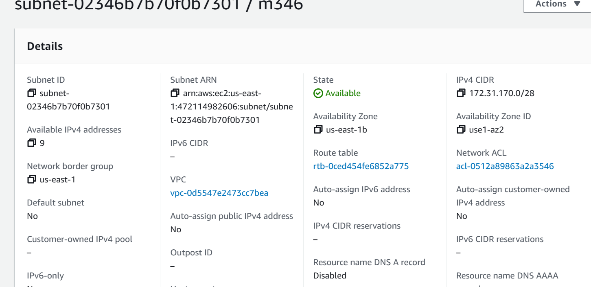

Subnetz mit der CIDR 172.31.170.0/28, da dies eine der noch nicht besetzten Optionen war.

== Interface

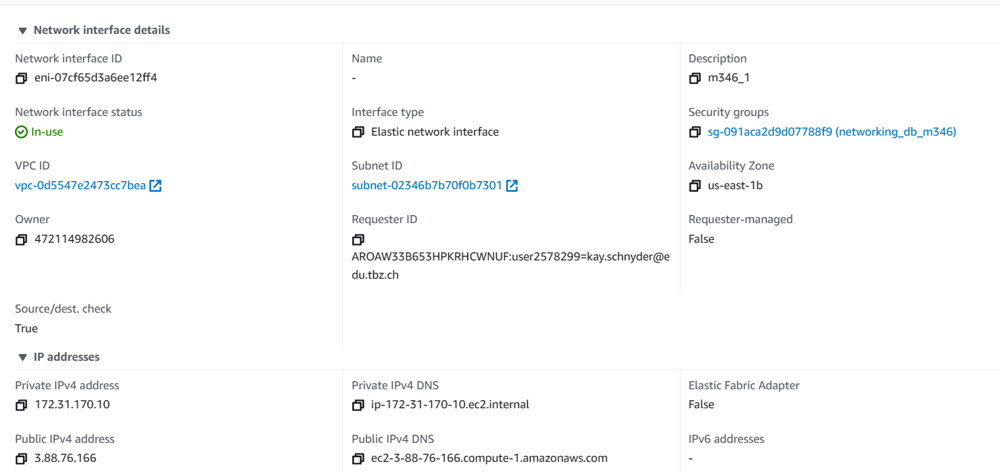

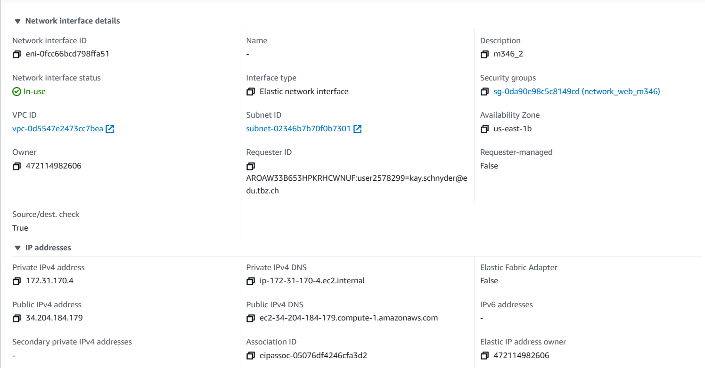

Beider Elastic IPs wurde eines der Interfaces zugeteilt. Das Network interface selbst hat eine zugeteilte Security group sowie auch die selben pulbic und private IPs wie dan nachher die Instanz haben wird.

== Security groups

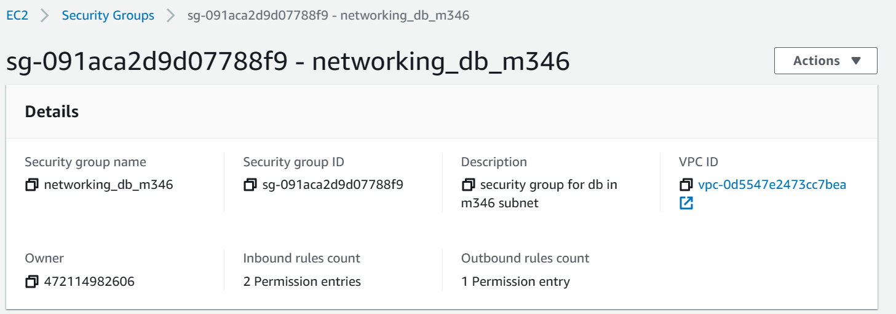

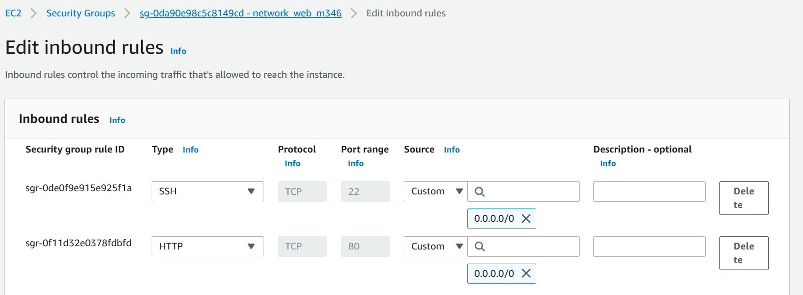

Die erste security group ist für die DB dabei ist der Port 22 und 3306 nur für innerhalb des Subnets zugänglich.
Die zweite ist für die Web Instance sind die ports 80 und 22 offen für überall.

== Instances

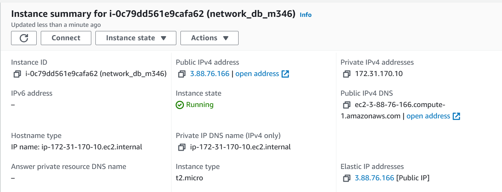

== Elastic IP

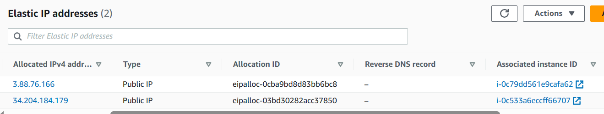