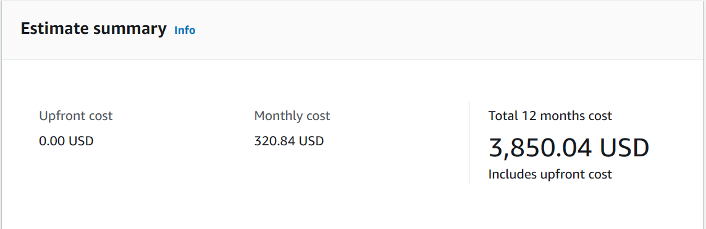
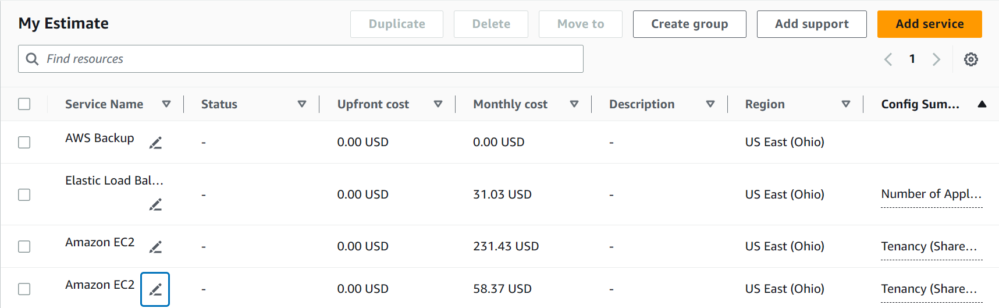
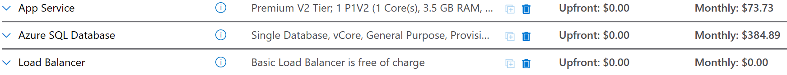
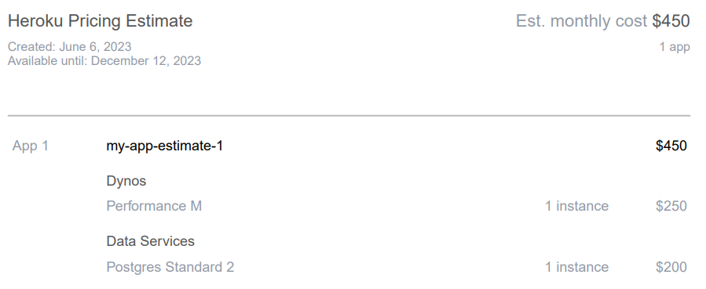
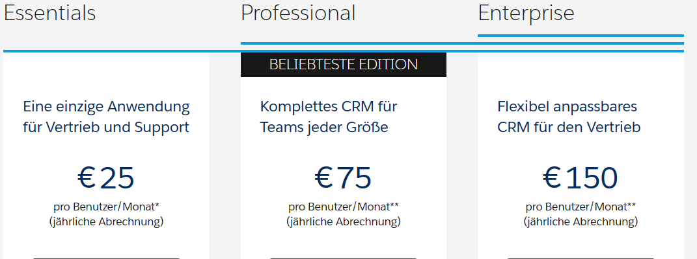
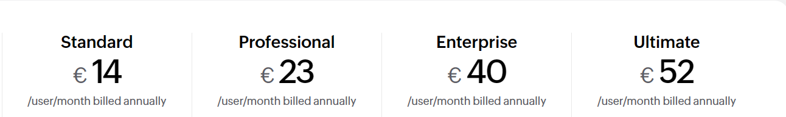

= KN06

== A) Kostenrechnung erstellen

=== AWS

Ausgewählt habe ich für die Server jeweils eine EC2 mit dem Standort Ohio ausgesucht.

Die Web EC2 hat einen Core 2GB RAM und 20GB Speicher. Zudem basiert sie auf Linux mit SQL Server Web.

Die DB EC2 hat zwei Cores 4GB RAM und 100GB Speicher. Zudem basiert sie auf Linux mit SQL Server Standard.

Dazu kommt noch der Loadbalancer mit 1GB traffic pro Stunde.

Zudem hat man das AWS Backup mit Backup für:

- Daily die letzten 7 Tagen
- Wöchentlich für den letzten Monat
- Monatlich für die letzten 3 Monate

=== Azure

All the services are located in the east US.
Azure has a Database service which is configured with a Backup and 100GB Storage.

For the App Service I used the Premium v2 version.

=== Heroku

Heroku arbeitet mit sogenannten Dynos. Dabei habe ich aus Performance Gründen, damit es genügend RAM hat die Performance M ausgewählt.
Als DB habe ich einen Standard 2 Postgres Data Service damit die 100GB Speicher enthalten sind.

=== Salesforce

Bei Salesforce würde ich mich für die Essentials version entscheiden, da es soweit alles nötig enthält.
Das heisst man würde für 16 Mitarbeiter 400€ im Monat zahlen.

=== Zoho CRM

Bei Zoho bin ich mir nicht sicher, ob die Standard version alles enthält, weswegen ich mich für Professional entschieden hätte.
Somit würde ich bei Zoho 368€ im Jahr zahlen, wenn ich einen Jahresdeal abschliessen.

=== Fazit

IaaS kosten verhältnis mässig etwas mehr, da man auch mehr selber konfigurieren kann und gesamt auch mehr Optionen zur Verfügung hat.
Bei Zoho und Salesforce bin ich mir selber nicht ganz sicher was alles inbegriffen ist, Preismässig ist es aber auch dementsprechend deutlich günstiger als
die AWS, Azure oder Heroku Dienste. Zusätzlich müsste man die Kosten in Betracht ziehen, die sich ansammeln durch den Aufwand die Software je nachdem anzupassen und so weiter.
Somit sind die Kosten für das Umbauen nicht final nur anhand des Preises der Platform.

== B) Interpretation der Resultate

=== Angebot
Die Angebote unterscheiden sich schon stark, jedoch ist es nur mit dem Calculator schwierig zu sagen, da eventuell von gewissen Plattformen noch zusätzliche oder etwas verstecktere Kosten entstehen können.
Am Stärksten sieht man das es sich zwischen IaaS und SaaS unterscheidet, da auch der Umfang des inbegriffenen sehr stark variiert.

=== Billigstes
Das billigste ist Zoho, da man mit 386€ im Jahr durchkommt. Jedoch bin ich nicht ganz sicher was alles inbegriffen ist in dem Deal.
Auch an diesem Beispiel sieht man, dass SaaS günstiger ist, weil man viel weniger zur Verfügung hat.

=== Wieso, viel Teurer?
Bei AWS kann es sein, je nach Pricing Plan, habe ich ca. 400$ pro Monat oder als Vorauszahlung 15'000 dementsprechend ist es schwierig zu, sagen wie viel es letztendlich kosten wird.
