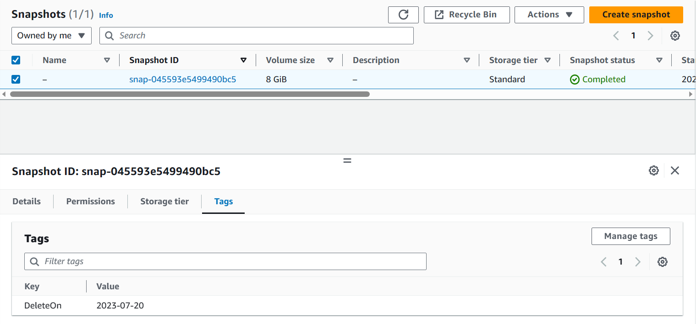
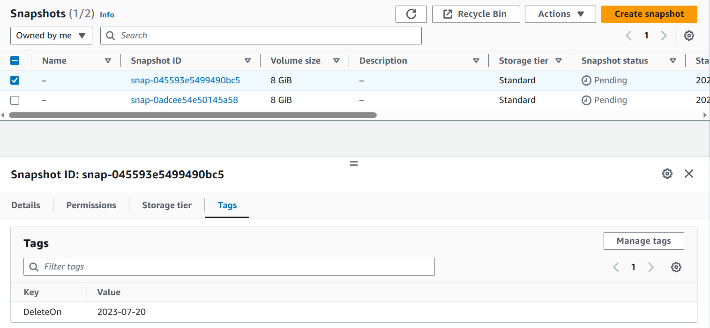
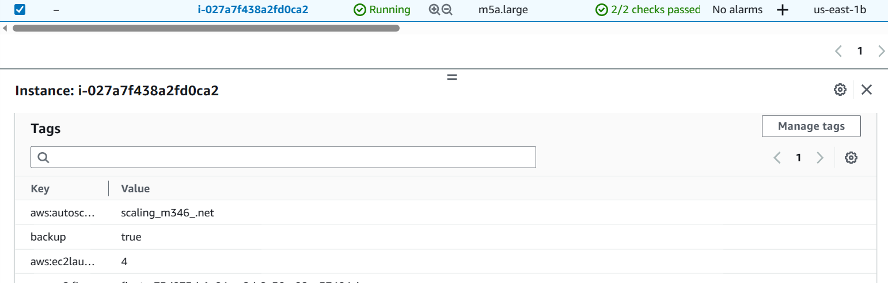
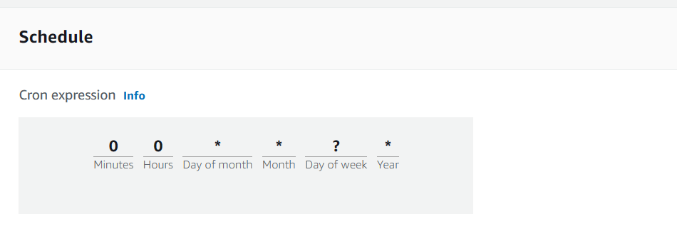
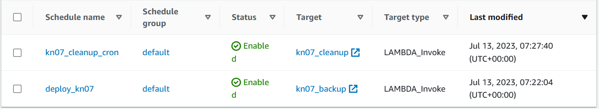

= KN07

== Backup

=== After cleanup

=== before cleanup

Bei einem der beiden Snapshots habe ich den Tag-Value auf 2023-07-12 gesetzt, damit das Cleanup-Script den Snapshot entfernt.

=== instance with tags

== Cron-Job

