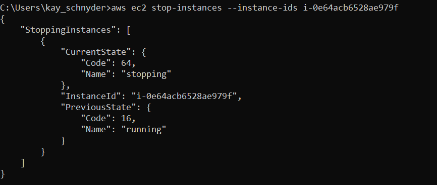
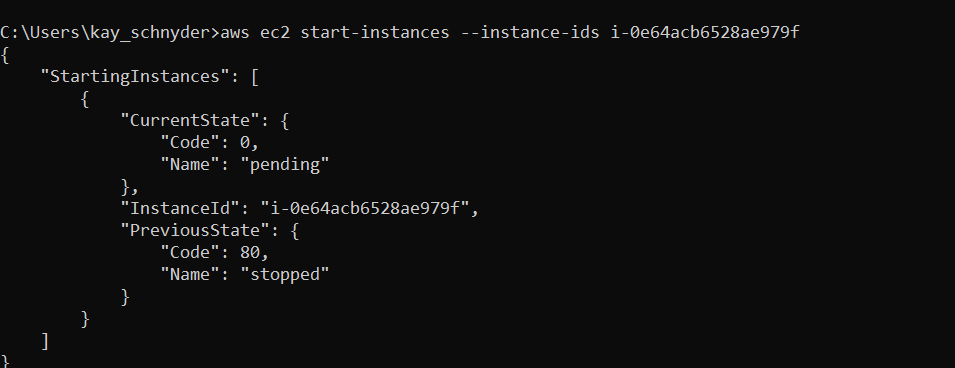
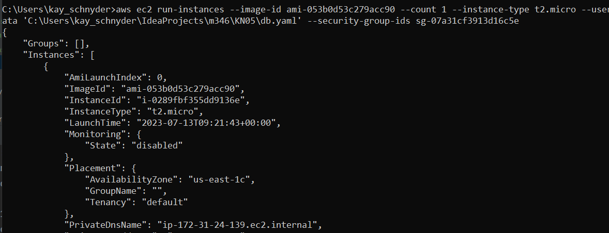

= kn08

== Stop instance

[bash]
----
aws ec2 stop-instances --instance-ids i-0e64acb6528ae979f
----

== Start Instance

[bash]
----
aws ec2 start-instances --instance-ids i-0e64acb6528ae979f
----

== New Instance

[bash]
----
aws ec2 run-instances --image-id ami-053b0d53c279acc90 --count 1 --instance-type t2.micro --user-data 'C:\Users\kay_schnyder\IdeaProjects\m346\KN05\db.yaml' --security-group-ids sg-07a31cf3913d16c5e
----

